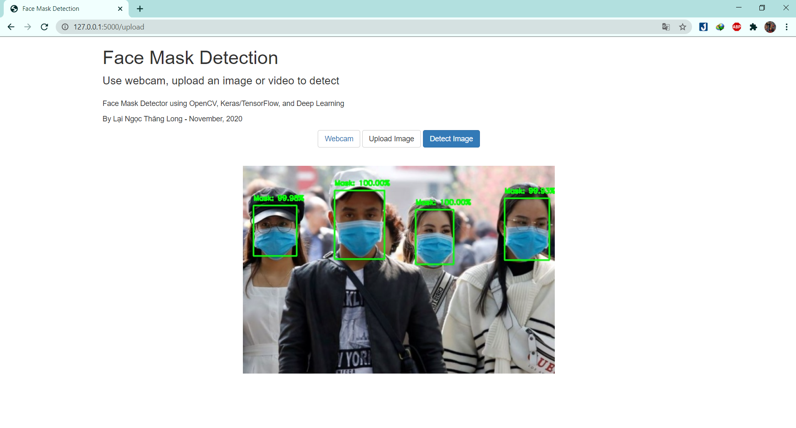
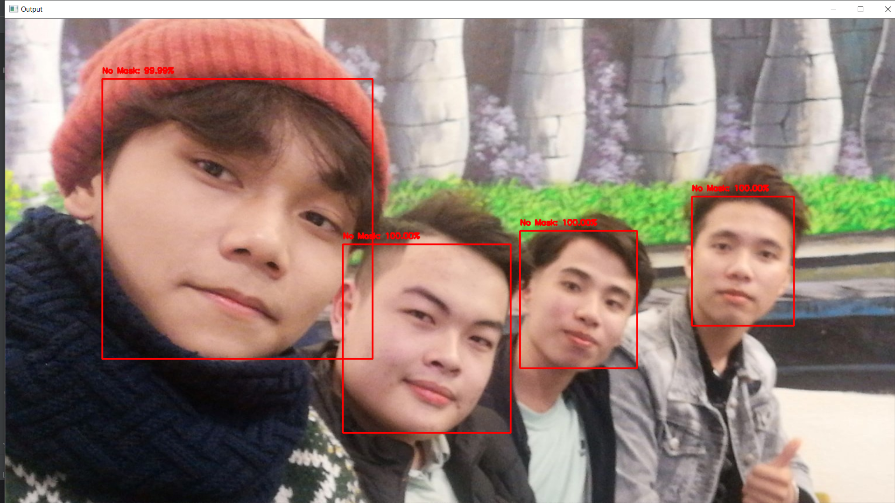
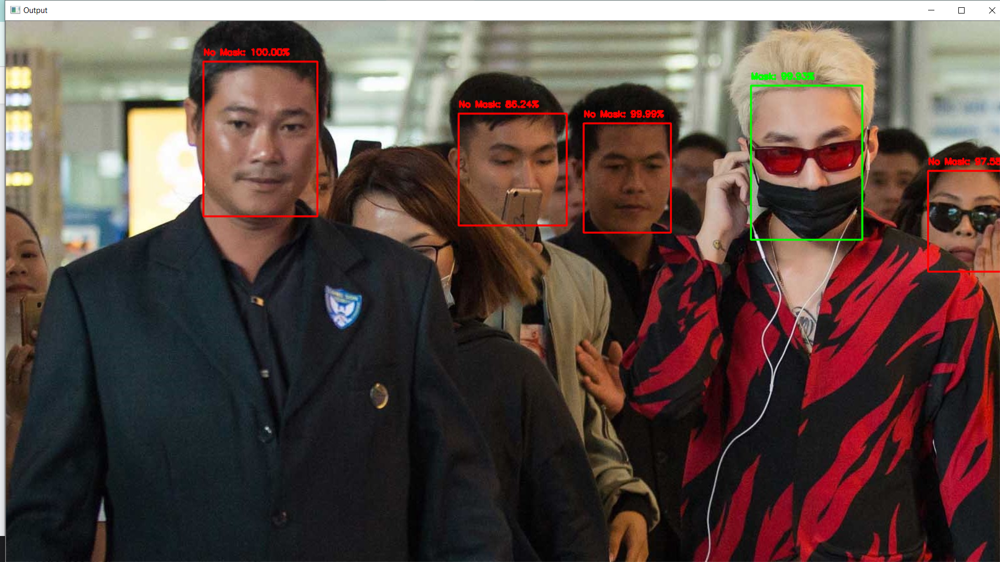
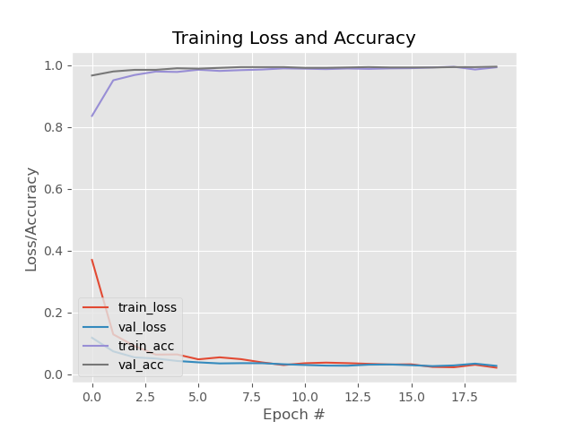

# Face Mask Detector-TL

## INTRODUCTION ##
**COVID-19 face mask detector using OpenCV, Keras/TensorFlow, Flask and Deep Learning**
- This is my project in DL Class, which is organized by AI4E. The COVID-19 mask detector I'm building here today could potentially be used to help ensure your safety and the safety of others. COVID-19 face mask detector used to:
  - Detect face masks in images
  - Detect face masks in video
  - Detect face masks in real-time video streams
- Solution:
  - Detecting faces in images/video
  - Extracting each individual face
  - Applying our face mask classifier

## PROJECT DEMO ##
- **Demo web by Flask**

- **Detect in images**

- **Detect in video**

- **Detect in real-time video streams**

## FRAMEWORK USED ##
- OpenCV
- Tensorflow
- Keras
- Flask

## INSTALLATION AND RUNNING ##
1. Clone the repo
2. Use the package manager pip to install package

    `pip install -r requirement.txt`
 
3. Open source code and read how to run

## RESULT ##

## NEED IMPROVEMENT ##
Our current method of detecting whether a person is wearing a mask or not is a two-step process:

- Step 1: Perform face detection
- Step 2: Apply our face mask detector to each face

If enough of the face is obscured, the face cannot be detected, and therefore, the face mask detector will not be applied.

## REFERENCE ##
- [Pyimagesearch](https://www.pyimagesearch.com/2020/05/04/covid-19-face-mask-detector-with-opencv-keras-tensorflow-and-deep-learning/)
- [Mobilenet model](https://phamdinhkhanh.github.io/2020/09/19/MobileNet.html#6-t%C3%A0i-li%E1%BB%87u)
- [MobileNetV2: Inverted Residuals and Linear Bottlenecks - Mark Sandler, Andrew Howard](https://arxiv.org/abs/1801.04381)
- [Towardsdatascience](https://towardsdatascience.com/covid-19-face-mask-detection-using-tensorflow-and-opencv-702dd833515b)
- [data-flair blog](https://data-flair.training/blogs/face-mask-detection-with-python/)
- [Github](https://github.com/chandrikadeb7/Face-Mask-Detection)
- [Youtube](https://www.youtube.com/watch?v=Ax6P93r32KU)
